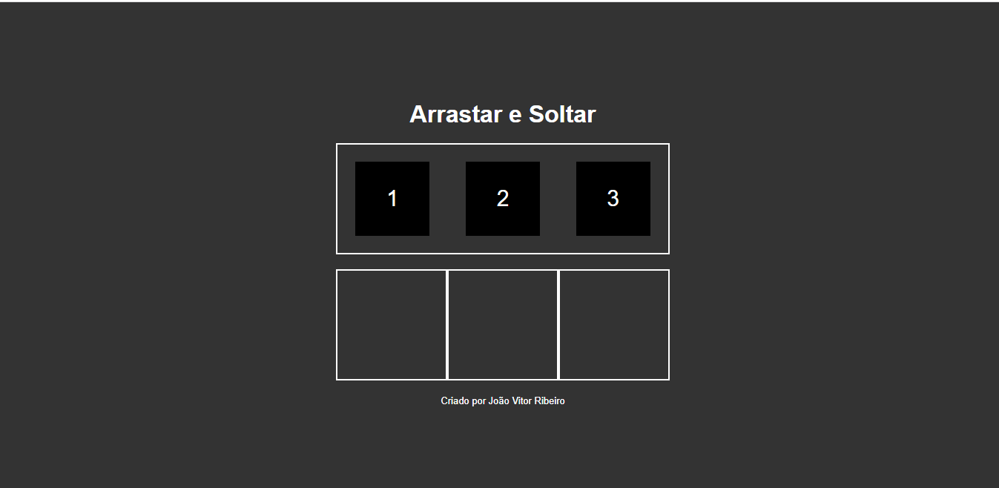
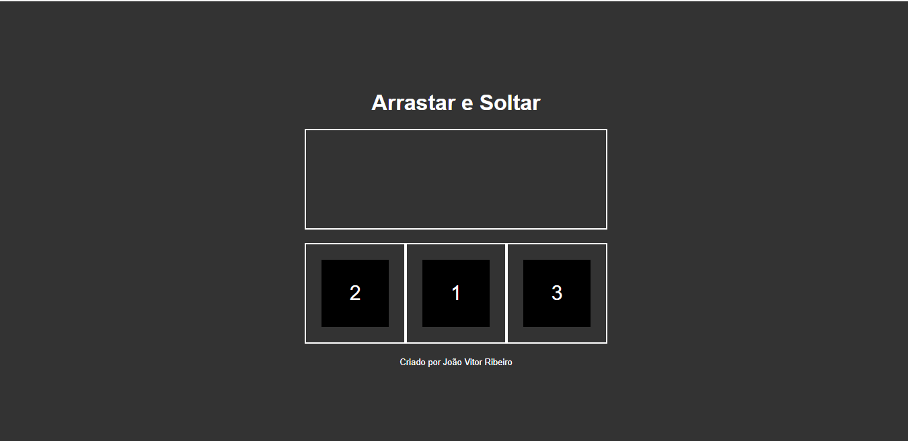
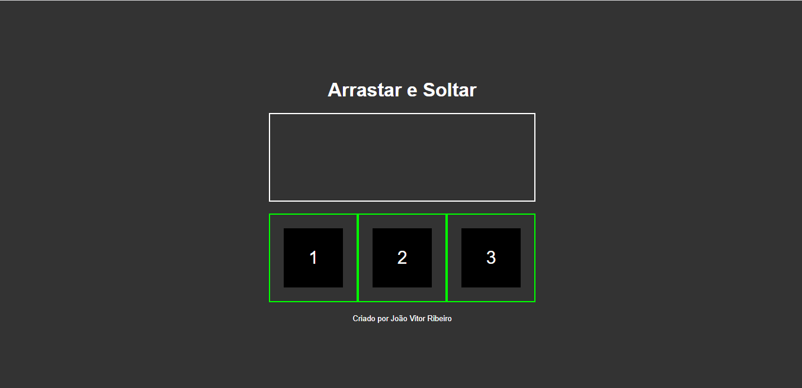

# 🛠 Tecnologias utilizadas:
 

  

  
   
  
  

 

# 💻  Sobre o Projeto:
<li>O Projeto Arasta e solta é uma página web que permite aos usuários realizarem o drag-and-drop ou seja arrastarem,soltarem,encaixarem e movimentarem peças .</li>
 

# ⚙️ Funcionalidades:
<li>Na primeira seção da página, os usuários serão apresentados a 3 caixas pretas numeradas de 1 a 3 que devem se arrastaadas e soltadas para três locais que por sua vez devem ser preenchidos pelas caixas.</li>
<li>Após clicar em qual caixa deseja selecionar, o usuário deve encaixar ela so seu devido local, com o objetivo de colocarem em ordem numérica.</li>
<li>Caso as caixas fiquem na ordem correta, o local ficará com um contorno verde </li>

# 🎨 Pré-visualização :
## Apresentação do jogo:

## Ordem das caixas incorretamente:

## Ordem das caixas corretamente:

# 🦸 Autor:

 
<a href="https://www.linkedin.com/in/jo%C3%A3o-vitor-ribeiro-dias-339a56258/" target="_blank">João Vitor RIbeiro Dias</a>
